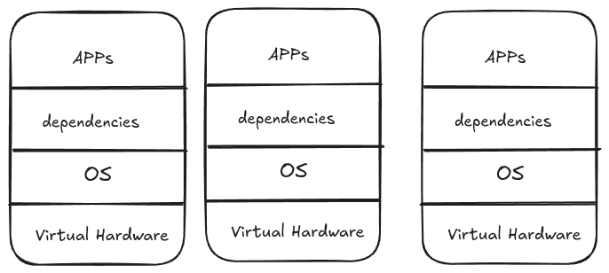
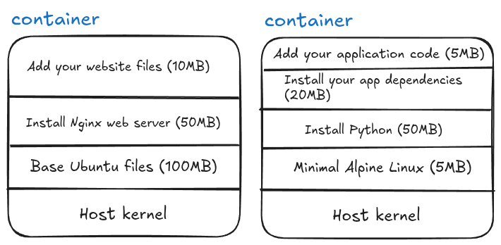
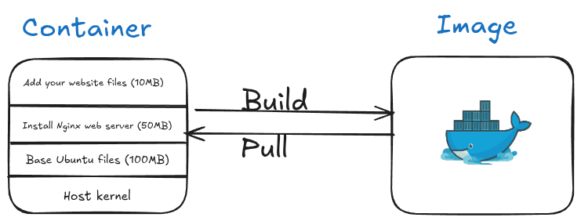
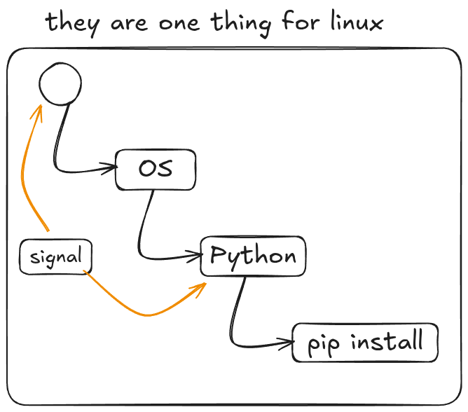
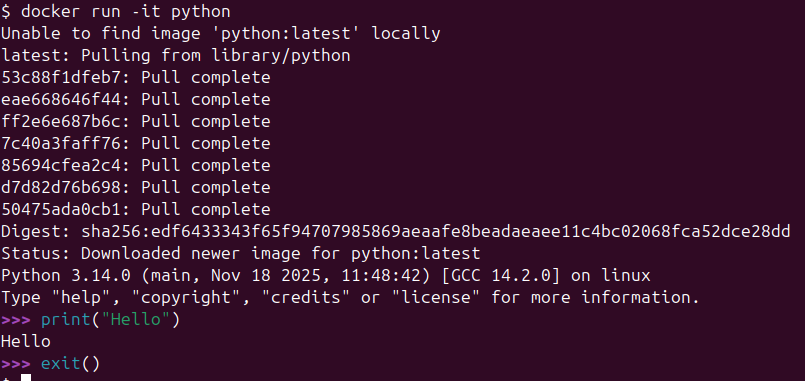

We will talk in this topic about containers and how to put the snake (python) inside them.


This image is a reference to a scene from an Egyptian movie, where a character humorously asks what’s inside the box.

## Introduction to Containers

<Callout type="definition">

    <p><strong>Containers: an easy way of making bundle of an application with some requirments and with abilty to deploy it in many places</strong> .</p>
</Callout>

Applications inside a box and with some requirments? Hmmm, but Virtual Machine can do this. We need to know how the whole story begun.

## The Beginning: Bare Metal

<div class="callout callout-note">
  <div class="callout-icon">📝</div>
  <div class="callout-content">
    <div class="callout-title">One App, One Server</div>
    <p>Each application needed its own physical server. Servers ran at 5-15% capacity but you paid for 100%.</p>
  </div>
</div>


### Virtual Machines (VMs) Solution

<div class="callout callout-success">
  <div class="callout-icon">✅</div>
  <div class="callout-content">
    <div class="callout-title">Split One Server Into Many</div>
    <p>.</p>
  </div>
</div>

How it works:

```text
Physical Server
├── Hypervisor
├── VM 1 (Full OS + App)
├── VM 2 (Full OS + App)
└── VM 3 (Full OS + App)
```



<div class="callout callout-warning">
  <div class="callout-icon">⚠️</div>
  <div class="callout-content">
    <div class="callout-title">The Hidden Costs</div>
    <p>VMs solved hardware waste but created new problems at scale.</p>
  </div>
</div>


Every VM runs a complete operating system, if you have 1,000 VMs, you're running 1,000 complete operating systems, each consuming 2-4GB RAM, taking minutes to boot, and requiring constant maintenance.


Every operating system needs a license


Each VM's operating system needs monthly patches, security updates, backups, monitoring, and troubleshooting, at 1,000 VMs, you're maintaining 1,000 separate operating systems.

You need specialized VMware administrators, OS administrators for each type of VM, network virtualization experts, and storage specialists, even with templates, deploying a new VM takes days because it requires coordination across multiple expert teams.


## Container Architecture

If you notice in the previous image, we are repeating the OS. We just need to change the app and its requirements.

Think about it: an OS is just a kernel (for hardware recognition - the black screen that appears when you turn on the PC) and user space. For running applications, we don't need the full user space, we only need the kernel (for hardware access).

Another thing - the VMs are already installed on a real (physical) machine that already has a kernel, so why not just use it? If we could use the host's kernel and get rid of the OS for each VM, we'd solve half the problem. This is one of the main ideas behind containers.

How can we do this? First, remember that the Linux kernel is the same everywhere in the world - what makes distributions different is the user space. Start with the kernel, add some tools and configurations, you get Debian. Add different tools, you get Ubuntu. It's always: kernel + different stuff on top = different distributions.

How do containers achieve this idea? By using **layers**. Think of it like a cake:



You can stop at any layer! Layer 1 alone (just the base OS files) is a valid container - yes, you can have a "container of an OS", but remember it's not a full OS, just the user space files without a kernel. Each additional layer adds something specific you need.

After you finish building these layers, you can save the complete stack as a template, this template is called an **image**. When you run an image, it becomes a running **container**.



Remember, we don't care about the OS - Windows, Linux, macOS - they all have kernels. If your app needs Linux-specific tools or Windows-specific tools, you can add just those specific components in a layer and continue building. This reduces dependencies dramatically.

The idea is: start from the kernel and build up only what you need. But how exactly does this work?

### The Linux Magic: cgroups and namespaces

Containers utilize Linux kernel features, specifically **cgroups** and **namespaces**.

**cgroups (control groups):**  It controls how much CPU, memory, and disk a process can use.

**Example:**
- Process A: Use maximum 2 CPU cores and 4GB RAM
- Process B: Use maximum 1 CPU core and 2GB RAM
- Container = cgroups ensures Process A can't steal resources from Process B

**namespaces:** These manage process isolation and hierarchy, they make processes think they're alone on the system.

**Example:** Process tree isolation

```text
Host System:
├── Process 1 (PID 1)
├── Process 2 (PID 2)
└── Process 3 (PID 3)

Inside Container (namespace):
└── Process 1 (thinks it's PID 1, but it's actually PID 453 on host)
    └── Process 2 (thinks it's PID 2, but it's actually PID 454 on host)
```

The container's processes think they're the only processes on the system, completely unaware of other containers or host processes.

### Containers = cgroups + namespaces + layers

If you think about it, **cgroups + namespaces = container isolation**. You start with one process, isolated in its own namespace with resource limits from cgroups. From that process, you install specific libraries, then Python, then pip install your dependencies, and each step is a layer.



You can even utilize the same idea of Unix signals to control containers, and send SIGTERM to stop a process, and by extension, stop the entire container.

Because namespaces and cgroups are built into the Linux kernel, we only need the kernel, nothing else! No full operating system required.

### The Tool: Docker

There are many technologies that achieve containerization (rkt, Podman, containerd), but the most famous one is made by Docker Inc. The software? They called it "Docker." 

Yeah, super creative naming there, folks. :) 


If you install Docker on Windows, you are actually installing Docker Desktop, which creates a lightweight virtual machine behind the scenes. Inside that VM, Docker runs a Linux environment, and your Linux containers run there.

If you want to run Windows containers, Docker Desktop can switch to Windows container mode, but those require the Windows kernel and cannot run inside the Linux VM.

Same for macOS.

If you install Docker on Linux, there is no virtual machine involved. You simply get the tools to create and run containers directly


## Install Docker

For Windows of macOS see see: [Overview of Docker Desktop](https://www.docker.com/get-started/).

If you are Ubuntu run these commands:

```shell
curl -fsSL https://get.docker.com -o get-docker.sh
```
Then

```shell
sudo sh ./get-docker.sh --dry-run
```

Then run to verify:

```shell
sudo docker info
```

If writing sudo everytime is annoying, then you need to yourself(the name of the user) to the docker group and then restart your machine:

Run the following with replacing `mahmoudxyz` with your username:
```shell
sudo usermod -aG docker mahmoudxyz
```

After you restart your PC, you will not need to use `sudo` again before `docker`.

## Basic Docker Commands

Let's start with a simple command:

```shell
docker run -it python
```

This command **creates and starts** a container (a shortcut for `docker create` + `docker start`). The `-i` flag keeps STDIN open (interactive), and `-t` allocates a terminal (TTY).

Another useful thing about `docker run` is that if you **don’t have the image locally**, Docker will automatically **pull it** from Docker Hub.

The output of this command shows some downloads and other logs, but the most important part is something like:

```
Digest: sha256:[text here]
```

This string can also serve as your **image ID**.

After the download finishes, Docker will directly open the **Python interactive mode**:



You can write Python code here, but if you **exit Python**, the entire container stops. This illustrates an important concept: a **container is designed to run a single process**. Once that process ends, the container itself ends.

| Command | Description | Example |
|--------|-------------|---------|
| `docker pull` | Downloads an image from Docker Hub (or another registry) | `docker pull fedora` |
| `docker create` | Creates a container from an image **without starting it** | `docker create fedora` |
| `docker run` | Creates **and starts** a container (shortcut for create + start) | `docker run fedora` |
| `docker ps` | Lists **running** containers | `docker ps` |
| `docker ps -a` | Lists **all** containers (stopped + running) | `docker ps -a` |
| `docker images` | Shows all downloaded images | `docker images` |

### **Useful Flags**

| Flag | Meaning | Example |
|------|----------|---------|
| `-i` | Keep STDIN open (interactive) | `docker run -i fedora` |
| `-t` | Allocate a TTY (terminal) | `docker run -t fedora` |
| `-it` | Interactive + TTY → lets you use the container shell | `docker run -it fedora bash` |
| `ls` (in Docker context) | Used inside container to list files (Linux command) | `docker run -it ubuntu ls` |


To remove a container, use:

```shell
docker rm <container_id_or_name>
```

You can only remove stopped containers. If a container is running, you need to stop it first with:

```shell
docker stop <container_id_or_name>
```

## Port Forwarding 

When you run a container that exposes a service (like a web server), you often want to access it from your host machine. Docker allows this using the `-p` flag:

```shell
docker run -p <host_port>:<container_port> <image>
```

**Example:**

```shell
docker run -p 8080:80 nginx
```
1. 8080 → the port on your host machine
2. 80 → the port inside the container that Nginx listens on

Now, you can open your browser and visit: http://localhost:8080 …and you’ll see the Nginx welcome page.

## Docker Networks (in nutshell)

Docker containers are isolated by default. Each container has its own network stack and cannot automatically see or communicate with other containers unless you connect them.

A Docker network allows containers to:
- Communicate with each other using container names instead of IPs.
- Avoid port conflicts and isolate traffic from the host or other containers.
- Use DNS resolution inside the network (so container1 can reach container2 by name).


**Default Networks**

Docker automatically creates a few networks:

1. bridge → the default network for standalone containers.
2. host → containers share the host’s network.
3. none → containers have no network

If you want multiple containers (e.g., Jupyter + database) to talk to each other safely and easily, it’s best to create a custom network like `bdb-net`.

**Example:**

```shell
docker network create bdb-net
```

## Jupyter Docker

Jupyter Notebook can easily run inside a Docker container, which helps avoid installing Python and packages locally.

Don't forget to create the network first:
```shell
docker network create bdb-net
```

```shell
docker run -d --rm --name my_jupyter --mount src=bdb_data,dst=/home/jovyan -p 127.0.0.1:8888:8888 --network bdb-net -e JUPYTER_ENABLE_LAB=yes -e JUPYTER_TOKEN="bdb_password" --user root -e CHOWN_HOME=yes -e CHOWN_HOME_OPTS="-R" jupyter/datascience-notebook
```


**Flags and options:**

| Option | Meaning |
|--------|---------|
| `-d` | Run container in **detached mode** (in the background) |
| `--rm` | Automatically remove container when it stops |
| `--name my_jupyter` | Assign a custom name to the container |
| `--mount src=bdb_data,dst=/home/jovyan` | Mount local volume `bdb_data` to `/home/jovyan` inside container |
| `-p 127.0.0.1:8888:8888` | Forward **host localhost port 8888** to container port 8888 |
| `--network bdb-net` | Connect container to Docker network `bdb-net` |
| `-e JUPYTER_ENABLE_LAB=yes` | Start Jupyter Lab instead of classic Notebook |
| `-e JUPYTER_TOKEN="bdb_password"` | Set a token/password for access |
| `--user root` | Run container as root user (needed for certain permissions) |
| `-e CHOWN_HOME=yes -e CHOWN_HOME_OPTS="-R"` | Change ownership of home directory to user inside container |
| `jupyter/datascience-notebook` | The Docker image containing Python, Jupyter, and data science packages |


After running this, access Jupyter Lab at: http://127.0.0.1:8888. Use the token `bdb_password` to log in.


## Topics (coming soon)

Docker engine architecture, docker image deep dives, container deep dives, Network